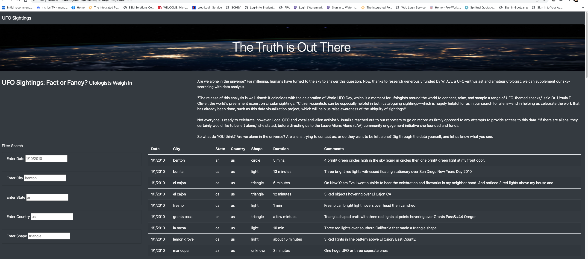

# UFOs

## Overview of Project - 

###  Purpose of Analysis: 

The purpose of this project was provide a more in-depth analysis of UFO sightings by allowing users to filter for multiple criteria at the same time. Using multiple filters on a previously download data set, the goal is to allow user to narrow their choice by city, country, state, and shape for documented UFO Sightings

### Results: 

#### Use of Web tool - 

The tool below have be used to identify locations with numerous frequent UFO sightings. When the filters are entered properly, user to narrow their choice by city, country, state, and shape for documented UFO Sightings. Each filter presents the correct format for the search. 

#### Design Recommendation - 

It may be useful to add additional information such as recent year data and the number of confirmed sightings for each recorded event. 

UFO-fans and believers in additional beings outside of earth may use the new webpage by going through the process of using the search criteria.

#### Recommendations for further development

As stated above, additional data is always useful when attempting to have proof or string evidence of the existence of extraterrestrial life forms. Moreover, it may be interesting to add the weather conditions during the sighting. 